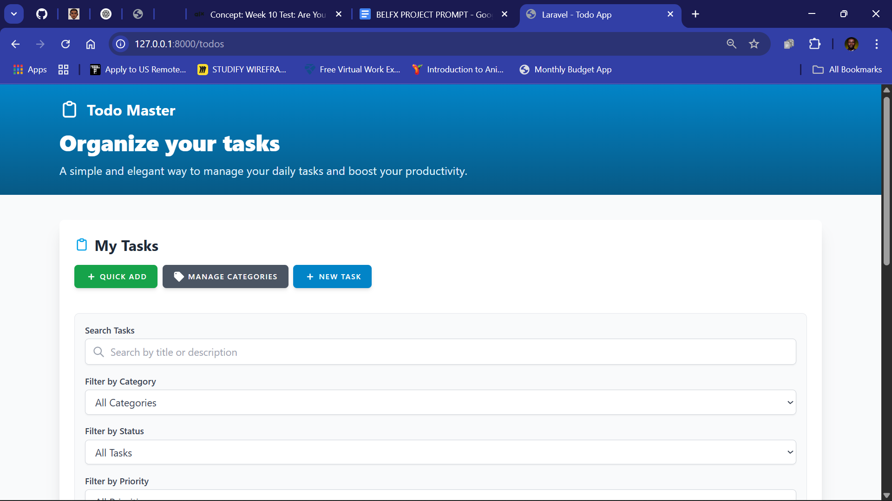
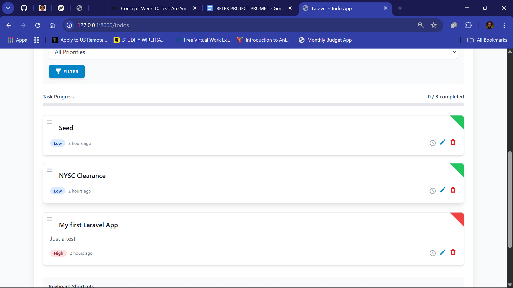
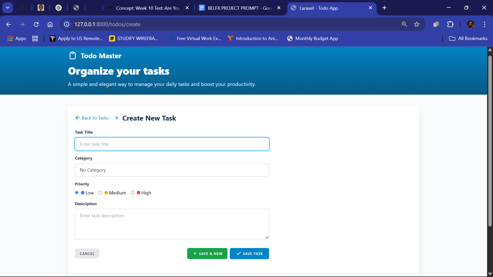

# 📝 Laravel Todo App

A modern, full-featured Todo application built with Laravel, Blade, Tailwind CSS, and Vite. Organize your tasks, manage categories, and boost your productivity with a beautiful and responsive UI.

## 🚀 Features

- 🗂️ Task management: Create, edit, delete, and filter todos
- 📋 Category management: Organize tasks by category and color
- ⭐ Priority levels: Low, Medium, High with visual indicators
- ✅ Mark tasks as complete/incomplete
- 🔍 Powerful filtering: Search, filter by category, status, and priority
- 🏷️ Quick add: Instantly add new tasks from the main screen
- 📦 Drag-and-drop sorting for tasks
- 🖥️ Responsive and modern UI with Tailwind CSS
- ⚡ Fast asset bundling with Vite
- 🔒 CSRF protection and validation error handling

## 🛠️ Getting Started

### Prerequisites
- PHP 8.1+
- Composer
- Node.js & npm

### Installation

1. **Clone the repository**
   ```sh
   git clone https://github.com/enyasystem/laravel-todo-app.git
   cd laravel-todo
   ```
2. **Install PHP dependencies**
   ```sh
   composer install
   ```
3. **Install frontend dependencies**
   ```sh
   npm install
   ```
4. **Copy and configure environment**
   ```sh
   cp .env.example .env
   # Edit .env as needed (uses SQLite by default)
   ```
5. **Generate app key**
   ```sh
   php artisan key:generate
   ```
6. **Run migrations**
   ```sh
   php artisan migrate
   ```
7. **Build frontend assets**
   ```sh
   npm run build
   ```
8. **Start the development server**
   ```sh
   php artisan serve
   ```

Visit [http://localhost:8000](http://localhost:8000) to use the app!

## 📁 Project Structure

- `app/Http/Controllers` — Application controllers
- `resources/views` — Blade templates
- `resources/js` & `resources/css` — Frontend assets
- `routes/web.php` — Web routes
- `database/migrations` — Database schema

## 🧑‍💻 Development
- Hot reload assets: `npm run dev`
- Rebuild assets: `npm run build`
- Clear caches: `php artisan optimize:clear`

## 🐞 Troubleshooting
- Make sure `storage/` and `bootstrap/cache/` are writable
- If you see session or error issues, run `php artisan migrate` and clear caches
- For asset issues, run `npm run build` and refresh the browser

## 📜 License

MIT

---

Made with ❤️ using Laravel, Blade, and Tailwind CSS.






